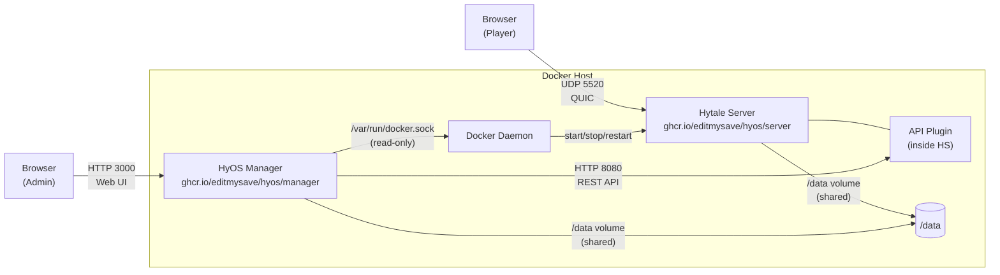
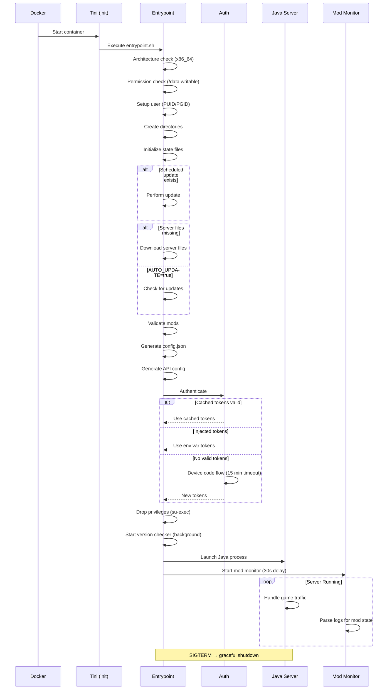

# System Architecture

HyOS is a multi-container system for running and managing Hytale dedicated servers. This document describes the high-level architecture, data flows, and security model.

## Table of Contents

- [Container Topology](#container-topology)
- [Data Flow](#data-flow)
- [Volume Structure](#volume-structure)
- [Startup Sequence](#startup-sequence)
- [State Files](#state-files)
- [Port Mapping](#port-mapping)
- [Security Model](#security-model)

---

## Container Topology



**Components:**

| Component | Image | Role |
|-----------|-------|------|
| Hytale Server | `ghcr.io/editmysave/hyos/server` | Game server with entrypoint scripts, API plugin |
| HyOS Manager | `ghcr.io/editmysave/hyos/manager` | Next.js web dashboard |
| Docker Daemon | — | Container lifecycle control (via socket) |

---

## Data Flow

```mermaid
graph TD
    subgraph Server Container
        EP[Entrypoint Scripts] -->|writes| SF[State Files<br/>/data/.state/]
        EP -->|generates| CF[config.json]
        EP -->|manages| MODS[/data/mods/]
        JAVA[Java Server Process] -->|logs| LOGS[stdout/stderr]
        APIP[API Plugin] -->|reads| JAVA
    end

    subgraph Manager Container
        WEB[Next.js App] -->|reads| SF
        WEB -->|REST API| APIP
        WEB -->|Docker socket| DOCK[Docker Daemon]
    end

    subgraph Host
        VOL[/data Volume] --- SF
        VOL --- CF
        VOL --- MODS
        SOCK[docker.sock] --- DOCK
    end

    ADMIN[Admin Browser] -->|HTTP 3000| WEB
    PLAYER[Game Client] -->|UDP 5520| JAVA
```

---

## Volume Structure

A single volume is mounted at `/data` and shared between both containers:

```
/data/
├── server/                     # Server files (auto-managed)
│   ├── HytaleServer.jar        # Server executable
│   ├── HytaleServer.aot        # AOT compilation cache
│   ├── config.json             # Server configuration
│   ├── whitelist.json          # Player whitelist (if enabled)
│   ├── permissions.json        # Permission groups and assignments
│   ├── Licenses/               # Third-party licenses
│   ├── logs/                   # Server log files
│   ├── mods/                   # Plugin runtime data
│   │   └── com.hytale_HytaleAPI/
│   │       └── config.json     # API plugin config (bcrypt hashed)
│   └── universe/               # World data
│       ├── players/            # Per-player data (UUID.json)
│       └── worlds/
│           └── default/        # Default world
│               ├── config.json
│               ├── chunks/     # Region files
│               └── resources/
├── Assets.zip                  # Game assets (auto-managed)
├── mods/                       # User mods directory
│   ├── MyMod-1.0.0.jar
│   ├── hytale-api-1.0.0.jar   # API plugin (auto-installed)
│   └── .disabled/              # Quarantined broken mods
├── backups/                    # Automatic backups
├── logs/
│   └── auto-update.log         # Update history
├── .auth/                      # OAuth tokens (mode 700)
│   └── tokens.json             # Cached tokens (mode 600)
├── .state/                     # State files for Manager UI
│   ├── server.json
│   ├── version.json
│   ├── auth.json
│   ├── config.json
│   ├── health.json
│   ├── mods.json
│   ├── update.json
│   └── manager-config.json     # Manager settings
├── .version                    # Current server version string
├── .broken-mods                # Version-tagged broken mod list
└── .update-on-restart          # Scheduled update flag (JSON)
```

---

## Startup Sequence



---

## State Files

All state files use atomic writes (temp file + rename) and ISO 8601 timestamps.

### Schemas

```typescript
// server.json
interface ServerState {
  status: "starting" | "running" | "stopped" | "crashed" | "unknown";
  pid: number | null;
  started_at: string | null;  // ISO 8601
  updated_at: string;         // ISO 8601
}

// version.json
interface VersionState {
  current: string;
  latest: string | null;
  needs_update: boolean;
  checked_at: string;  // ISO 8601
}

// auth.json
interface AuthState {
  status: "authenticated" | "pending" | "failed" | "timeout" | "unknown";
  authenticated: boolean;
  profile: string | null;     // Username
  expires_at: string | null;  // ISO 8601
  updated_at: string;         // ISO 8601
  // Only present when status is "pending":
  url?: string;               // Device auth URL
  code?: string;              // User code
}

// config.json (state copy — not the server config)
interface ConfigState {
  config: {
    server_name: string;
    motd: string;
    max_players: number;
    max_view_radius: number;
    default_world: string;
    default_gamemode: string;
    whitelist_enabled: boolean;
    local_compression: boolean;
    has_password: boolean;      // Never the actual password
  };
  updated_at: string;
}

// health.json
interface HealthState {
  status: "healthy" | "unhealthy";
  healthy: boolean;
  message: string;
  checks: Array<{
    name: string;
    status: "pass" | "fail" | "warn" | "skip";
    message: string;
  }>;
  checked_at: string;
}

// mods.json
interface ModsState {
  loaded: string[];                  // Successfully loaded filenames
  failed: Array<{
    file: string;                    // JAR filename
    error: string;                   // Error description
  }>;
  total: number;
  loaded_count: number;
  failed_count: number;
  updated_at: string;
}

// update.json
interface UpdateState {
  status: "idle" | "checking" | "downloading" | "updating" | "failed";
  message: string;
  last_check: string | null;
  next_check: string | null;
  auto_update_enabled: boolean;
  updated_at: string;
}
```

---

## Port Mapping

| Host Port | Container Port | Protocol | Service | Description |
|-----------|---------------|----------|---------|-------------|
| 30520 | 5520 | UDP | Hytale Server | QUIC game traffic (player connections) |
| 30356 | 8080 | TCP | API Plugin | REST API for server management |
| 30357 | 3000 | TCP | HyOS Manager | Web UI dashboard |

Host ports use the 30xxx range to avoid conflicts with other TrueNAS apps. The default Hytale server port is UDP 5520 — if no conflicts exist on your system, you can map host ports directly (e.g., `5520:5520/udp`). Internal container ports are configurable via environment variables (`SERVER_PORT`, `API_PORT`).

---

## Security Model

### Non-Root Execution

The container starts as root for initial setup (user creation, permission fixes), then drops privileges using `su-exec`:

```
Root → setup_user() → su-exec → hytale (PUID:PGID)
```

The `no-new-privileges` security option prevents re-escalation:

```yaml
security_opt:
  - no-new-privileges:true
```

### Token Storage

OAuth tokens are stored with restricted permissions:

| Path | Permissions | Description |
|------|-------------|-------------|
| `/data/.auth/` | `700` | Auth cache directory |
| `/data/.auth/tokens.json` | `600` | Cached OAuth tokens |

### Password Sanitization

- Server passwords are tracked as `has_password: true/false` in state files — never the actual value
- API plugin passwords are bcrypt-hashed (12 rounds) before writing to config
- The `$2y$` Apache format is converted to `$2a$` for Java bcrypt compatibility

### API Security

- Authentication via OAuth2 client credentials → JWT Bearer tokens
- JWT tokens use RS256 algorithm
- Rate limiting: 300 requests/minute (50 burst), 30/minute for auth endpoints
- CORS configurable (default: allow all origins)
- Audit logging available for request tracking

### Docker Socket

The Manager container mounts the Docker socket read-only:

```yaml
volumes:
  - /var/run/docker.sock:/var/run/docker.sock:ro
```

It is added to GID 0 (root group) for socket access but runs as UID 568. Socket access is used only for container lifecycle operations (start, stop, restart, logs).

### Base Image

Built on `eclipse-temurin:25-jre-alpine` with minimal attack surface:

| Package | Purpose |
|---------|---------|
| `tini` | PID 1 init for signal handling |
| `su-exec` | Lightweight privilege dropping |
| `jq` | JSON processing |
| `curl` | HTTP requests (OAuth, downloads) |
| `iproute2` | Network utilities (health checks) |
| `apache2-utils` | `htpasswd` for bcrypt hashing |
| `bash` | Shell runtime |
| `coreutils` | Standard utilities |
