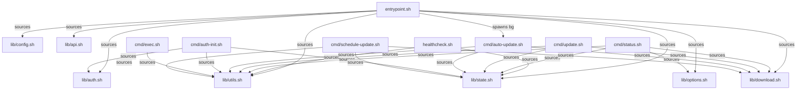
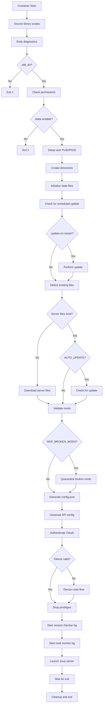

# Scripts Reference

All scripts live under `/opt/scripts/` in the container. Library scripts (`lib/`) are sourced by the entrypoint and other scripts. Command scripts (`cmd/`) are standalone executables for external use.

## Table of Contents

- [Script Relationships](#script-relationships)
- [Entrypoint](#entrypoint)
- [Library Scripts](#library-scripts)
- [Command Scripts](#command-scripts)
- [Health Check](#health-check)

---

## Script Relationships



---

## Entrypoint

### `entrypoint.sh`

The main container startup script. Orchestrates initialization, downloads, authentication, and server launch.

**Startup Sequence:**



**Signal Handling:**

- `SIGTERM` / `SIGINT` — Gracefully stops the server, updates state to `stopped`, and exits

**Key Environment Variables:**

`PUID`, `PGID`, `UMASK`, `SERVER_PORT`, `JAVA_XMS`, `JAVA_XMX`, `ENABLE_AOT`, `PATCHLINE`, `AUTO_UPDATE`, `SKIP_BROKEN_MODS`, `DEBUG`, `VERSION_CHECK_ENABLED`, `VERSION_CHECK_INTERVAL`

---

## Library Scripts

### `lib/utils.sh`

Core utility library sourced by all scripts.

**Logging Functions:**

| Function | Description |
|----------|-------------|
| `log_info <msg>` | Blue info message |
| `log_warn <msg>` | Yellow warning message |
| `log_error <msg>` | Red error message |
| `log_debug <msg>` | Gray debug message (only when `DEBUG=true`) |
| `log_success <msg>` | Green success message |
| `log_section <title>` | Bordered section header |
| `log_separator` | Horizontal divider line |
| `log_step <msg>` | Step indicator (no newline) |
| `log_step_done [msg]` | Complete step with green checkmark |
| `log_step_fail [msg]` | Complete step with red X |
| `log_step_status <msg> <color>` | Complete step with custom color |

**JSON Helpers:**

| Function | Description |
|----------|-------------|
| `json_object <key=value...>` | Build a JSON object with auto-type detection |
| `json_array <item...>` | Build a JSON array |

Auto-type detection handles numbers, booleans (`true`/`false`), nested objects/arrays, and strings (with proper escaping).

**Boolean Helpers:**

| Function | Description |
|----------|-------------|
| `is_true <value>` | Returns 0 if value is `true`, `yes`, `on`, or `1` (case-insensitive) |
| `is_false <value>` | Returns 0 if value is `false`, `no`, `off`, or `0` |

**File and Process Utilities:**

| Function | Description |
|----------|-------------|
| `wait_for_file <path> <timeout>` | Block until file exists |
| `is_process_running <pid>` | Check if PID is alive |
| `get_process_pid <name>` | Find PID by process name |
| `env_or_default <var> <default>` | Read env var with fallback |
| `trim <string>` | Strip leading/trailing whitespace |
| `is_empty <string>` | Check if string is empty or whitespace |

---

### `lib/state.sh`

Manages persistent state via atomic JSON files in `/data/.state/`.

**Core Operations:**

| Function | Description |
|----------|-------------|
| `init_state_dir` | Create state directory and default files |
| `_atomic_write <file> <content>` | Write via temp file + rename |
| `_safe_read <file>` | Read with fallback to empty object |
| `state_get_all` | Combined snapshot of all state files |
| `state_cleanup` | Wipe all state files |

**Server State** (`server.json`):

| Function | Description |
|----------|-------------|
| `state_set_server <status> [pid]` | Set server status and optional PID |
| `state_get_server` | Read full server state |
| `state_get_server_field <field>` | Read a single field |

**Version State** (`version.json`):

| Function | Description |
|----------|-------------|
| `state_set_version <current> <latest> <needs_update>` | Set version info |
| `state_get_version` | Read version state |

**Auth State** (`auth.json`):

| Function | Description |
|----------|-------------|
| `state_set_auth <status> [profile] [expires] [url] [code]` | Set auth status |
| `state_get_auth` | Read auth state |

**Config State** (`config.json`):

| Function | Description |
|----------|-------------|
| `state_set_config <json>` | Set sanitized config (no passwords) |
| `state_get_config` | Read config state |

**Health State** (`health.json`):

| Function | Description |
|----------|-------------|
| `state_set_health <status> <message> <checks_json>` | Set health results |
| `state_get_health` | Read health state |

**Mods State** (`mods.json`):

| Function | Description |
|----------|-------------|
| `state_set_mods <loaded_json> <failed_json>` | Set mod loading results |
| `state_get_mods` | Read mods state |

**Broken Mods** (`.broken-mods`):

| Function | Description |
|----------|-------------|
| `state_add_broken_mod <version> <filename>` | Add to broken list |
| `state_get_broken_mods <version>` | Get broken mods for a version |
| `state_clear_broken_mods` | Clear all broken mod entries |

**Update State** (`update.json`):

| Function | Description |
|----------|-------------|
| `state_set_update <status> <message>` | Set update status |
| `state_get_update` | Read update state |

**Scheduled Updates** (`.update-on-restart`):

| Function | Description |
|----------|-------------|
| `state_set_update_scheduled [version]` | Create schedule flag |
| `state_is_update_scheduled` | Check if flag exists |
| `state_get_update_scheduled` | Read schedule details |
| `state_clear_update_scheduled` | Remove schedule flag |

---

### `lib/auth.sh`

Implements OAuth2 Device Code Flow for Hytale authentication.

| Function | Description |
|----------|-------------|
| `authenticate` | Main flow: injected tokens → cached tokens → device flow |
| `perform_device_auth` | Execute device code flow with polling |
| `refresh_access_token` | Refresh an expired token |
| `fetch_profile` | Get username from account API |
| `create_game_session` | Create server session token |
| `load_cached_tokens` | Load and validate `tokens.json` |
| `save_auth_tokens` | Persist tokens (file mode 600) |
| `init_auth_cache` | Create `.auth/` directory (mode 700) |
| `is_token_expired <token>` | Check JWT expiry (5-minute buffer) |
| `base64url_decode <string>` | Decode JWT payload |

**Exports:** `SESSION_TOKEN`, `IDENTITY_TOKEN`, `OWNER_UUID`

**OAuth Endpoints:**

| Endpoint | Purpose |
|----------|---------|
| `https://oauth.accounts.hytale.com/oauth2/device/code` | Request device code |
| `https://oauth.accounts.hytale.com/oauth2/token` | Exchange code for tokens |
| `https://account-data.hytale.com/api/account/profile` | Fetch user profile |
| `https://sessions.hytale.com/api/session/server` | Create game session |

---

### `lib/options.sh`

Builds JVM and Hytale server command-line arguments from environment variables.

| Function | Description |
|----------|-------------|
| `build_java_args` | Construct JVM flags (memory, GC, AOT, diagnostics) |
| `build_hytale_options` | Build 30+ Hytale CLI options from `HYTALE_*` vars |
| `build_server_args` | Combine assets path, bind port, auth tokens, and all options |
| `get_options_json` | Return current options as JSON |

**GC Configuration:**

- **G1GC** (default): `MaxGCPauseMillis`, `NewSizePercent`, `MaxNewSizePercent`, `HeapRegionSize`, `StringDeduplication`, `AlwaysPreTouch`, `ParallelRefProcEnabled`
- **ZGC**: `UseZGC`, `ZGenerational`, `ZCollectionInterval`

---

### `lib/config.sh`

Generates server `config.json` and whitelist from environment variables.

| Function | Description |
|----------|-------------|
| `generate_config` | Create `config.json` from env vars or JSON override |
| `validate_config` | Verify `config.json` is valid JSON |
| `get_config_json` | Return config for Web UI (password removed) |

Private helpers: `_generate_whitelist`, `_update_config_state`

---

### `lib/download.sh`

Manages server file downloads, extraction, and version tracking.

| Function | Description |
|----------|-------------|
| `detect_existing_files` | Auto-detect Server/Assets layout variations |
| `get_current_version` | Read version from `.version` file |
| `get_latest_version` | Query hytale-downloader for latest |
| `check_for_update` | Compare current vs latest |
| `download_server_files` | Download, extract, and verify initial files |
| `perform_update` | Update with backup, extraction, verification |
| `run_downloader_with_auth_state` | Run downloader and capture OAuth URLs |

**File Layout Detection:**

The script auto-detects two possible directory layouts:

- Layout 1: `/data/Server/HytaleServer.jar`
- Layout 2: `/data/game/Server/HytaleServer.jar`

---

### `lib/api.sh`

Configures the HytaleAPI REST plugin.

| Function | Description |
|----------|-------------|
| `api_generate_config` | Generate plugin `config.json` with hashed credentials |
| `api_install_plugins` | Copy plugin JARs from `/opt/plugins` to `/data/mods` |
| `api_hash_password <password>` | Bcrypt hash via `htpasswd` (12 rounds) |
| `api_read_manager_config` | Read credentials from `manager-config.json` |

---

## Command Scripts

### `cmd/status.sh`

Reports comprehensive server status.

```bash
# Human-readable output
docker exec hyos-server /opt/scripts/cmd/status.sh

# JSON output
docker exec hyos-server /opt/scripts/cmd/status.sh --json
```

**JSON output fields:** `server` (running, pid, uptime_seconds), `version` (current, latest, needs_update), `resources` (memory_used/total, disk_used/total), `config` (JVM settings, port), `timestamp`.

---

### `cmd/update.sh`

Manually trigger a server update. The server must be stopped.

```bash
# Check for updates (dry run)
docker exec hyos-server /opt/scripts/cmd/update.sh --check

# Update with backup
docker exec hyos-server /opt/scripts/cmd/update.sh --backup --force
```

**Process:** Verify stopped → detect files → compare versions → backup → download → extract → verify → update `.version`.

---

### `cmd/auto-update.sh`

Background service for periodic update checks.

```bash
# Single check and exit (for cron)
docker exec hyos-server /opt/scripts/cmd/auto-update.sh --once

# Continuous loop (started by entrypoint)
/opt/scripts/cmd/auto-update.sh
```

**Environment Variables:** `AUTO_UPDATE_INTERVAL`, `AUTO_UPDATE_TIME`, `AUTO_UPDATE_RESTART`, `AUTO_UPDATE_BACKUP`

**Logs:** Written to `/data/logs/auto-update.log`

**Signal Handling:** `SIGTERM`/`SIGINT` trigger graceful shutdown. Server stop uses `SIGTERM` with 60-second timeout, then `SIGKILL`.

---

### `cmd/auth-init.sh`

Interactive re-authentication.

```bash
docker exec -it hyos-server /opt/scripts/cmd/auth-init.sh
```

Checks for existing valid tokens, prompts before re-authenticating, runs the device code flow, fetches profile, and saves tokens.

---

### `cmd/exec.sh`

Execute a server console command by writing to the server process stdin.

```bash
docker exec hyos-server /opt/scripts/cmd/exec.sh "say Hello World"
docker exec hyos-server /opt/scripts/cmd/exec.sh "op add PlayerName"
```

**Mechanism:** Writes the command string to `/proc/<server-PID>/fd/0` (stdin file descriptor).

---

### `cmd/schedule-update.sh`

Schedule a server update for the next container restart.

```bash
# Schedule
docker exec hyos-server /opt/scripts/cmd/schedule-update.sh

# Check if scheduled
docker exec hyos-server /opt/scripts/cmd/schedule-update.sh --check

# Cancel
docker exec hyos-server /opt/scripts/cmd/schedule-update.sh --clear
```

Creates a `.update-on-restart` flag file (JSON with target version) that the entrypoint checks on startup.

---

## Health Check

### `healthcheck.sh`

Periodic health probe for Docker and the Manager UI.

```bash
# Simple check (exit 0 = healthy, 1 = unhealthy)
docker exec hyos-server /opt/scripts/healthcheck.sh

# JSON output
docker exec hyos-server /opt/scripts/healthcheck.sh --json
```

**Checks Performed:**

| Check | What It Verifies | Failure Impact |
|-------|------------------|----------------|
| `process` | `HytaleServer.jar` process is running | Unhealthy |
| `port` | UDP port 5520 is bound | Unhealthy |
| `data_dir` | `/data` is writable | Unhealthy |
| `jar` | `HytaleServer.jar` exists | Unhealthy |
| `memory` | System memory usage | Warning only (>90%) |

**Docker Integration:**

```yaml
healthcheck:
  test: ["CMD", "/opt/scripts/healthcheck.sh"]
  interval: 30s
  timeout: 10s
  retries: 3
  start_period: 180s
```

The 180-second start period accounts for first-run downloads and authentication.
